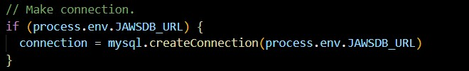
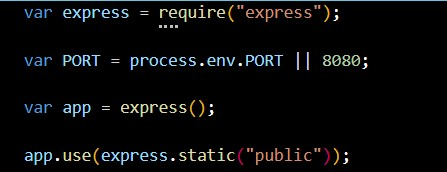

# Burger Devour
Eat all of the burgers that you want! This application uses express handlebars and MySQL to run. Decide whether you want to devour the burger or trash it. If you devour, it will appear on the other side but if you delete it, it is gone forever.

## Getting Started
To deploy the project into Heroku make sure that you include JawsDB MySql add on from heroku. For testing out on your local machine, npm install dependencies then on terminal follow with npm start. After this, open the browser at localhost8080.

* For Heroku deployment, make sure to add the connection to JawsDB on the “config/connection.js”:

 
## Installing
* npm install express
* npm install express-handlebars
* npm install mysql

Localhost deployment code

## Deployment
https://arcane-thicket-32283.herokuapp.com/
 
### Authors
Sergio Perez
